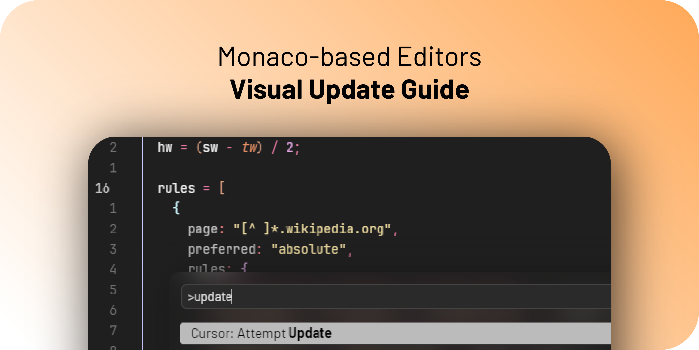

# Monaco Editors Visual Update Guide



This is a series of CSS updates to Monaco-based editors (VSCode, Cursor, etc.)
that aims to modernise and improve UX, adding rounded curves, blurred
backgrounds and the sort.

- [Monaco Editors Visual Update Guide](#monaco-editors-visual-update-guide)
  - [Instructions](#instructions)
    - [Before we start](#before-we-start)
    - [`styles.css`](#stylescss)
    - [Install the Custom UI Style extension](#install-the-custom-ui-style-extension)
    - [Install a theme of your choice](#install-a-theme-of-your-choice)
    - [Point to the `styles.css` location on the `settings.json` file](#point-to-the-stylescss-location-on-the-settingsjson-file)
    - [Add more options to `settings.json`](#add-more-options-to-settingsjson)
    - [Customize the editor's color theme and visual elements by adding these settings](#customize-the-editors-color-theme-and-visual-elements-by-adding-these-settings)
    - [(Option) Create keyboard shortcuts to speed iterations](#option-create-keyboard-shortcuts-to-speed-iterations)
  - [Contributing](#contributing)

## Instructions

### Before we start  

I highly recommend watching this video first to understand the general directions:  

[](https://www.youtube.com/watch?v=9_I0bySQoCs)

### `styles.css`

Use the provided [`styles.css`](./styles.css) as a starting point and put it somewhere (I put on the IDE's settings location, but anywhere should work)

### Install the [Custom UI Style](https://marketplace.visualstudio.com/items?itemName=subframe7536.custom-ui-style) extension  

On the the [video](https://www.youtube.com/embed/9_I0bySQoCs?si=MB5FZVBb-oUT3W1G) Glenn uses another extension. This is fine, but Custom UI Style allows us to disable certain Electron features, such as the title bar, completely.  

### Install a theme of your choice  

I use the [Min Theme](https://marketplace.visualstudio.com/items?itemName=miguelsolorio.min-theme) one, and you'll see that all my settings are configured to work with it. For your theme, you'll have to adapt the values accordingly.  

### Point to the `styles.css` location on the `settings.json` file  

```json
"custom-ui-style.external.imports": [
  "file://C:/Users/<user>/point/to/the/location/of/styles.css"
],
```

> [!tip] You'll have to use the protocol `file://` to point to the file on the disk  

### Add more options to [`settings.json`](./settings.json)

```json
/* Option to customise the UI's font (I use the Barlow font) */
"custom-ui-style.font.sansSerif": "Barlow",

/* These ones hide the title bar */
"window.titleBarStyle": "native",
"custom-ui-style.electron": { 
  "frame": false, 
  "titleBarStyle": "hidden" 
},

/* Custom UI Style extension specific to restart the IDE when changing configs */
"custom-ui-style.preferRestart": true,
"custom-ui-style.reloadWithoutPrompting": true,
```

### Customize the editor's color theme and visual elements by adding these settings

```json
"workbench.colorTheme": "Min Dark",
"workbench.colorCustomizations": {

  /* Both of these are of Cursor, use the corresponding one to VSCode */
  "editorCursor.background": "#000",
  "editorCursor.foreground": "#f18a62",
  "editor.linkedEditingBackground": "#00000000",
  "editor.wordHighlightBackground": "#00000000",
  "editor.wordHighlightTextBackground": "#00000000",

  /* Notice that all of these use my accent colour of choise (orange) and just adjust the opacity throught the last 2 digits */
  "editor.selectionBackground": "#f18a6224",
  "editor.selectionHighlightBackground": "#f18a6224",
  "settings.modifiedItemIndicator": "#f18a62",
  "editor.wordHighlightStrongBorder": "#00000000",
  "editor.wordHighlightStrongBackground": "#f18a6224",
  "editor.hoverHighlightBackground": "#f18a6224",
  "editor.foldBackground": "#f18a6224",
  "editor.findMatchBorder": "#f18a62",
  "editor.findMatchForeground": "#f18a62",
  "editor.findMatchHighlightForeground": "#f18a62",
  "editor.findMatchBackground": "#f18a6212",
  "editor.findMatchHighlightBackground": "#f18a6212",
  "editor.rangeHighlightBackground": "#f18a6212",
  "editor.findMatchHighlightBorder": "#f18a6224",
  "editor.rangeHighlightBorder": "#f18a6224",

  /* 
  These settings adjust some lists, I may have duplicated them in the CSS
  file. 
  */
  "editorIndentGuide.background1": "#1f1f1f",
  "editorIndentGuide.activeBackground1": "#545454",
  "editorActionList.focusBackground": "#bcbbbc",
  "list.focusBackground": "#bcbbbc",
  "list.focusForeground": "#000",
  "quickInputList.focusBackground": "#bcbbbc",
  "quickInputList.focusForeground": "#000",
  "settings.focusedRowBackground": "#bcbbbc",
}
```

> [!note] These settings are optimized for the Min Dark theme. If using a different theme, adjust the color values accordingly.

### (Option) Create keyboard shortcuts to speed iterations

I use a couple of hotkeys to speed my workflow when adjusting these settings. You can configure these both through the `Preferences: Open Keyboard Shortcuts` command or in the `keybindings.json` file through `Preferences: Open Keyboard Shortcuts (JSON)`

1. Reloading Custom UI Style: <kbd>Ctrl</kbd>+<kbd>Alt</kbd>+<kbd>R</kbd>

```json
{
  "command": "custom-ui-style.reload",
  "key": "ctrl+alt+r"
},
```

2. Toggle Developer Tools: <kbd>Ctrl</kbd>+<kbd>Alt</kbd>+<kbd>F12</kbd>

```json
{
  "key": "ctrl+alt+f12",
  "command": "workbench.action.toggleDevTools"
},
```

3. Open Settings JSON: <kbd>Ctrl</kbd>+<kbd>Alt</kbd>+<kbd>,</kbd>

```json
{
  "command": "workbench.action.openSettingsJson",
  "key": "ctrl+alt+,"
},
```

## Contributing

Feel free to open issues or pull requests with additional settings or improvements. When contributing:

- Keep settings organized by category
- Include comments explaining the purpose of each setting
